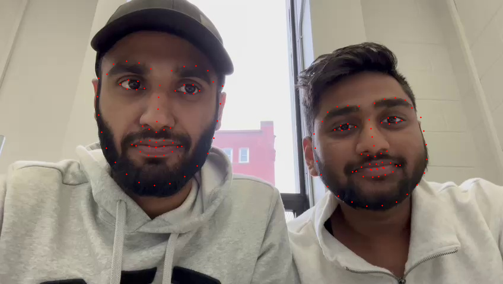
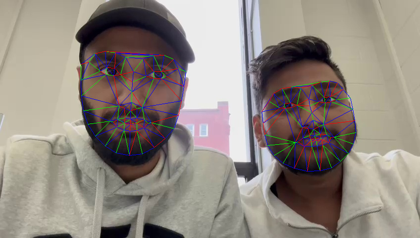
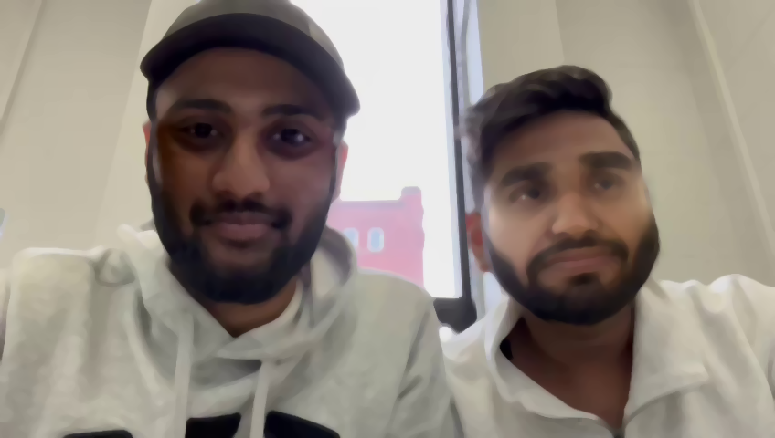

# FaceSwap
Face swapping between two images or two faces in a single image. It is similar to like using Snapchat face filters.

The aim of this project is to implement an end-to-end pipeline to swap faces in a video just like Snapchat’s face swap filter or [this face swap website](http://faceswaplive.com/)

### Team Members

- Mandeep Singh
- Chinmay Kate


## Results


### Detecting Facial Landmarks



## Using Delaunay triangulation

### Triangulation


### Warping and Blending


## Using Thin Plate Spline

### Warping and Blending


## Usage Guidelines

### Wrapper.py

Wrapper.py has three command line arguments to input -

1. Model type to choose: either delaunay or tps
2. input_type to choose: either image or video
3. input_path to add: path of the source image or video

<!-- #DEFAULT condition

Default setting of Model as 'delaunay, input_type as 'image' and image address is given as input_path:-

```
python3 Wrapper.py
``` -->

An example of running Wrapper.py with all the arguments is shown below:

```
python3 Wrapper.py --Model delaunay --input_type video --input_path Data/Data1.mp4
```

'Data' - folder contains the original video and the output video as well.

'Helper' - folder contains all the helper code required to run Wrapper.py

'Results' - folder contains other test run outputs of the models as well.

'other' - folder contains the source files for above test runs.  

